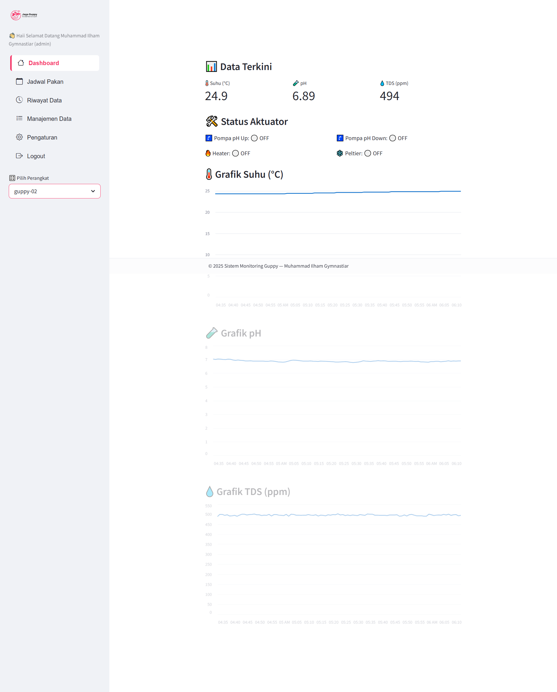

# 🐟 JagaGuppy: Sistem Monitoring & Otomasi Budidaya Ikan Guppy Berbasis IoT


[](https://www.espressif.com/)
[](https://www.arduino.cc/)
[](https://streamlit.io/)
[](https://supabase.com/)
[](LICENSE)

## 📸 Dashboard Preview

*(Upload screenshot web dashboard Anda ke folder assets, lalu ganti link ini nanti)*


> **Sistem Cerdas Pengelola Kualitas Air & Pakan Otomatis dengan Logika Fuzzy**
>
> Proyek ini adalah solusi *end-to-end* untuk pembudidaya Guppy yang mengintegrasikan sensor kualitas air presisi, kontrol aktuator otomatis menggunakan Fuzzy Logic, notifikasi real-time via Telegram, dan manajemen data terpusat melalui Dashboard Web.

---

## 📑 Daftar Isi
- [📖 Tentang Proyek](#-tentang-proyek)
- [✨ Fitur Utama](#-fitur-utama)
- [🏗️ Arsitektur Sistem](#️-arsitektur-sistem)
- [🛠️ Teknologi & Hardware](#️-teknologi--hardware)
- [🚀 Instalasi & Konfigurasi](#-instalasi--konfigurasi)
- [📱 Penggunaan](#-penggunaan)
- [📂 Struktur Database](#-struktur-database)

---

## 📖 Tentang Proyek

Ikan Guppy membutuhkan kondisi air yang spesifik untuk pertumbuhan optimal. Sistem ini memecahkan masalah pemantauan manual dengan mengotomatiskan tiga aspek utama:
1.  **Stabilisasi pH**: Menggunakan algoritma **Fuzzy Logic** untuk menentukan durasi aktif pompa pH Up/Down, mencegah perubahan pH yang drastis (shock).
2.  **Kontrol Suhu**: Otomatis menyalakan *Heater* saat dingin (< 24°C) atau *Peltier* saat panas (> 28°C).
3.  **Pakan Pintar**: Jadwal pakan otomatis yang menyesuaikan dengan usia ikan (Burayak, Remaja, Dewasa).

---

## ✨ Fitur Utama

### 1. 📡 Monitoring & Kendali IoT (ESP32)
* **Sensor Real-time**: Pembacaan Suhu (DS18B20), pH (Analog), dan Kepadatan Zat Terlarut (TDS).
* **Fuzzy Logic Controller**: Mengatur durasi pompa pH berdasarkan tingkat keasaman/kebasaan (Sangat Asam s.d. Sangat Basa).
* **Smart Feeding**: Servo otomatis memberi pakan sesuai jadwal (Burayak: 3x sehari, Remaja: 2x, Dewasa: 1x).
* **OLED Display**: Menampilkan data sensor dan waktu lokal (RTC) langsung di perangkat.

### 2. 🤖 Integrasi Telegram Bot
Kontrol penuh dalam genggaman melalui perintah bot:
* `/sensor`: Cek kondisi air saat ini.
* `/beripakan`: Perintah pakan manual jarak jauh.
* `/notifon` & `/notifoff`: Atur notifikasi peringatan bahaya.
* **Alert System**: Notifikasi instan jika parameter air kritis.

### 3. 📊 Dashboard Monitoring (Streamlit)
* **Multi-User & Role**: Login aman untuk Admin dan User biasa.
* **Visualisasi Data**: Grafik histori Suhu, pH, dan TDS.
* **Manajemen Aset**: CRUD untuk data User, Tank, dan Perangkat.
* **Laporan**: Ekspor log pakan dan riwayat aktuator.

---

## 🏗️ Arsitektur Sistem

Sistem terdiri dari dua node mikrokontroler dan satu server aplikasi:

1.  **Node Sensor (Slave)**: Membaca sensor fisik, menangani RTC, dan menampilkan data di OLED. Mengirim data via Serial ke Node Utama.
2.  **Node Utama (Master/ESP32)**: Menerima data sensor, menjalankan **Fuzzy Logic**, mengontrol Relay (Pompa/Heater) & Servo, serta berkomunikasi dengan Telegram dan Supabase.
3.  **Cloud Server**: Database Supabase menyimpan semua log, dan aplikasi Streamlit menyajikan antarmuka pengguna.

---

## 🛠️ Teknologi & Hardware

### Perangkat Keras (Hardware)
| Komponen | Fungsi | Pin (Node Master) | Pin (Node Slave) |
| :--- | :--- | :--- | :--- |
| **ESP32 DevKit** | Master Controller | - | - |
| **NodeMCU / Arduino** | Slave Sensor Reader | - | - |
| **Sensor pH (4502C)** | Mengukur pH Air | - | Pin 34 |
| **Sensor TDS** | Mengukur PPM Air | - | Pin 35 |
| **DS18B20** | Sensor Suhu Waterproof | - | Pin 4 |
| **RTC DS1302** | Modul Jam Real-time | - | 27, 14, 26 |
| **Relay 4 Channel** | Kontrol Aktuator | 25, 26, 14, 33 | - |
| **Servo Motor** | Dispenser Pakan | 13 | - |
| **OLED 128x64** | Display Lokal | - | I2C (SDA/SCL) |
| **Buzzer** | Alarm Lokal | 32 | - |

### Tech Stack
* **Firmware**: C++ (Arduino Framework), Libraries: `UniversalTelegramBot`, `WiFiManager`, `GravityTDS`, `DallasTemperature`.
* **Backend & DB**: Supabase (PostgreSQL + REST API).
* **Frontend**: Python (Streamlit, Pandas, Plotly).

---

## 🚀 Instalasi & Konfigurasi

### 1. Persiapan Firmware
1.  Clone repositori ini.
2.  Buka `node-sensor.ino` dan `node-aktuator.ino` di Arduino IDE/PlatformIO.
3.  Install library yang diperlukan via Library Manager.
4.  Sesuaikan kredensial di `node-sensor.ino`:
    ```cpp
    #define BOT_TOKEN "YOUR_TELEGRAM_BOT_TOKEN"
    #define CHAT_ID "YOUR_CHAT_ID"
    const String SUPABASE_KEY = "YOUR_SUPABASE_KEY";
    ```
5.  Upload `node-aktuator.ino` ke board Slave dan `node-sensor.ino` ke board Master ESP32.

### 2. Setup Dashboard (Python Streamlit)
Pastikan Python 3.8+ terinstall.
```bash
# Masuk ke direktori app
cd app

# Install dependencies
pip install streamlit supabase streamlit-option-menu pandas st-aggrid streamlit-autorefresh plotly

# Jalankan aplikasi
streamlit run app.py


